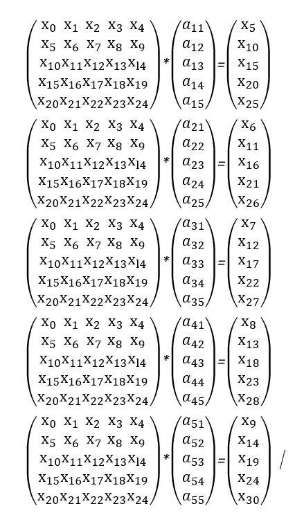
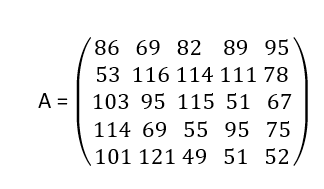

# Марио на холме

|   Cобытие   | Название | Категория | Сложность |
| :---------: | :------: | :-------: | :-------: |
| VKACTF 2023 |  Марио на холме  |  Crypto  |  Легкий  |

## Описание

>Автор: Inssurg3nt
>
>Описание: Добежав до очередного Холма, Марио столкнулся с непонятной шифровальной машиной, из которой нужно было каким то образом достать ключ. Машина оказалась сломаной, ведь функция расшифрования работала как-то неправильно.

# Решение

Из анализа исходников делаем несколько выводов: 
- использовался поточный шифр для шифрования вводимого текста;
- в качестве ключа выступает матрица 5*5;
- умножение матрицы на вектор по модулю 256 - это наш генератор гаммы для поточного шифра.
- Гамма дополнительно шифруется алгоритмом RSA

Немного подумав и поискав в интернете, можно найти так называемый шифр Хилла с модулем 256, на котором и основан генератор гаммы. 

Также можно заметить, что используемая матрица должна быть обратима по модулю 256, иначе расшифровать не получится.

Для восстановления исходной матрицы необходимо 6 известных векторов состояния, для этого воспользуемся особенностью поточного шифра.

Так как, последняя операция это XOR, а у нас есть возможность шифровать собственный текст, то мы можем найти зашифрованную гамму : 
- enc_gamma_1 = xor(ciphertext_1, payload). 

Далее необходимо понять, что гамма возводится в степени, равные простым числам, а значит, шифруя одно и то же собщение, мы можем восстановить гамму, используя алгоритм Евклида

Найдем 5 векторов состояния:
- dec_gamma = (pow(num_enc_gamma_1, a, N) * pow(num_enc_gamma_2, b, N)) % N

Далее, необходимо решить 5 матричных уравнений для восстановления каждой строки секретной матрицы, если Xi это гамма, где i = 0,...,11, а aij это элементы секретной матрицы: 



После чего секретная матрица получится: 



Далее остаётся лишь декодировать матрицу и получить ключ.

[Решение](solve.py)
### Флаг

Получаем наш флаг
```
vka{Hill_loved_algebra!!}
```