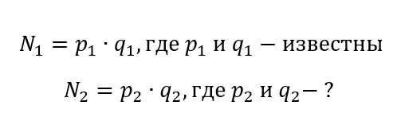
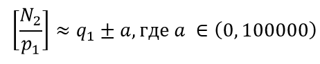
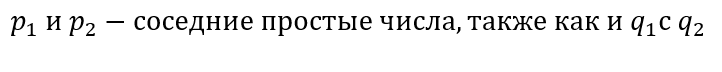

# Генератор Боузера

|   Cобытие   | Название | Категория | Сложность |
| :---------: | :------: | :-------: | :-------: |
| VKACTF 2023 |  Генератор Боузера  |  Crypto  |  Легкая  |

## Описание

>Автор: CryptoDjon
>
>Боузер разработал свой крутой генератор параметров RSA, но Марио не поверил в его надёжность и почувствовал какой-то подвох, поэтому предложил тому протестировать его генератор. Боузер воспринял это как вызов и послал Марио зашифрованное сообщение с использованием своих параметров с пометкой: "Тебе никогда его не прочитать!". Помогите Марио разоблачить Боузера!

>**nc ip port**

# Решение

Подключаемся к nc-сервису. По функционалу не густо, всего лишь можно 4 раза получить параметры RSA. 

Поначалу сложно понять, что происходит, так как исходных кодов нет. Используя библиотеку Crypto.PublicKey.RSA, получим все публичные и закрытые ключи. Для решения нам хватит и двух сгенерированных N. 

Пусть: 

Возьмём в качестве N, сгенерированные генератором числа, и внимательно их изучим:

N1 = 14579186324188874209434091579191335913907342586020923827979091819971272621895556269850874778731782498978310255317127413367718706564142370731591881289711977532566220105582469789492058573405832170245909323254855405230609039686694476489726560235336245888398871112797340970228663686338555375563959087391640275160373728592196666322351922510974050534152340135449863996164149353500255218268232900283925710022640117147031183262322301936789370157162585253147732452026110963256234979199235114236920023252207675809921379115364598723593737328401521956215749962466981583369108833626845673480375112924122317290294775165202996869831

N2 = 14579186324188874209434091579191335913907342586020923827979091819971272621895556269850874778731782498978310255317127413367718706564142370731591881289711977532566220105582469789492058573405832170245909323254855405230609039686694476489726560235336245888398871112797340970228663686338555375563959087391640274261761591079532850263319906032344366107638370187962138930692124509835148896927948175360255783850738478313108439827322990819973813787256741359646775675659850954797131920391421582165192259985198336605245862042297653542299852512449519023463266355320805148915190178218934561090530533276580239059822802680634971279369

Визуально можно заметить, что начало у N1 и N2 очень похожее, программно посчтиаем количество первых одинаковых десятичных цифр и получим половину от их длины, такой же результат и при сравнении битов. Это наталкивает на мысль, что есть что-то общего между N1 и N2. К сожалению, общих делителей ни у одного сгенерированного N не будет. Не всё так легко.

Далее попробуем поделить:



На примере указанных выше чисел, получаем, что


Это все указывает лишь на одно:



После этого лишь остаётся перебрать ближайшие простые числа к p1 или q1, пока N2 не поделится без остатка на одно из них.

Для расшифровки флага все указано в задании. Надо использовать AES  в режиме GCM, у которого указан nonce, ключом для него является зашифрованная RSA случайная строка.

Решение представлено на языке [Python](sploit.py).

### Флаг

```
vka{oh_no_backdoor_in_rsa_parameter_generator_by_bowser!}
```