# Марио-Змейка

|   Cобытие   | Название | Категория | Сложность |
| :---------: | :------: | :-------: | :-------: |
| VKACTF 2023 |  Марио-Змейка  |  Crypto  |  Средняя  |

## Описание

>Автор: CryptoDjon
>
>Марио и его друзья сантехники решили попробовать сыграть в [змейку](https://mario-snake.vkactf.ru), но Боузер снова оказался впереди них и поставил свой рекорд, который по его мнению никто не сможет побить! Помоги Марио и его друзьям поставить новый рекорд!


# Решение

Для начала попробуем потыкать функционал веб-сервиса, зарегаться, поиграть в змейку, посмотреть в таблицу рейтинга, посмотреть чужие личные кабинеты. После изучим исходный код, в нём явно не указано, где спрятан флаг, но при изучении функционала сайта становится понятно, что флаг, скорее всего, спрятан в закрытой информации у самого первого пользователя, не зря же у него ник Bowser.

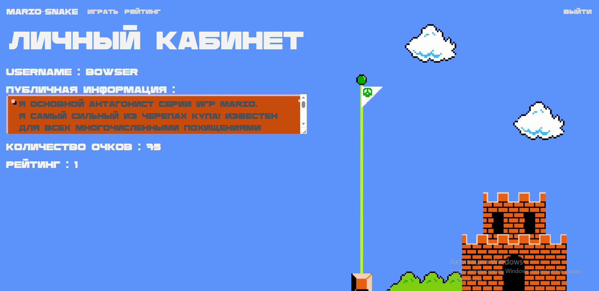

Далее на что стоит обратить внимание, так это на класс в исходном коде:

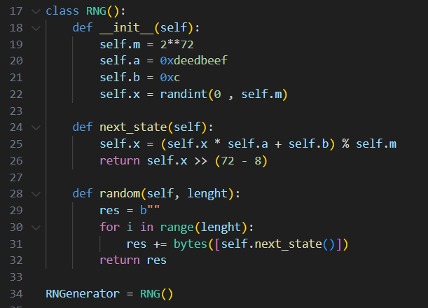

Смотрим, где используется в дальнейшем экземпляр класса:

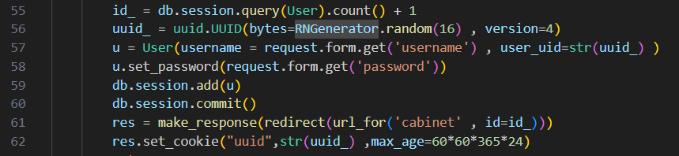

И замечаем по всему исходному коду, что куки статичны и сохранены в БД. Внимательно изучаем класс RNG и делаем вывод, что все куки являются частью одной последовательности Линейного Конгруэнтного Генератора (ЛКГ), но с усеченным выводом состояний, что и доставляет кучу проблем. Как ни странно, но даже в таком виде нельзя использовать ЛКГ, даже при таких условиях можно восстановить текущее состояние генератора и всю последовательность.

_Итак, последовательность решения_:
- Сначала найти информацию в интернете с тем, что делать, когда известны лишь частичные биты состояния ЛКГ (пожалуй, это самое сложное, ведь искать надо именно на английском *"Truncated LCG"*;

- В интернете мжно найти 2 способа восстановления состояния ЛКГ, в райтапе будет описан способ с использованием понятия решёток и на основе применения [LLL-алгоритма](https://www.researchgate.net/publication/220616664_Reconstructing_Truncated_Integer_Variables_Satisfying_Linear_Congruences);

- Разобраться, почему работает атака, и реализовать. Для этого вспомним, что в ЛКГ

    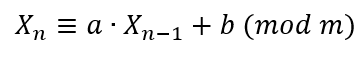
    
    Нам известны верхние 8 бит состояний (Yi), а 64 бита неизвестны (Zi), поэтому запишем состояние генератора как:

    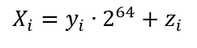

    Рассмотрим случай, когда b = 0, тогда получаем, что 

    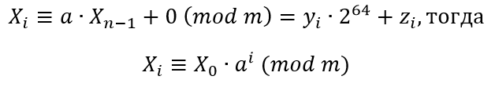

    Поскольку мы знаем 
    
    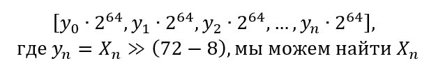

    Перепишем уравнения состояний:

    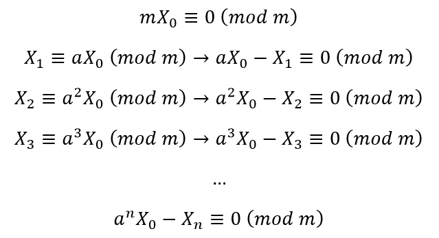

    Построим решётку L, где каждая строка Li умножается на 
    
    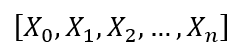  

    Первая строка - 

    

    Вторая строка - 

    

    И т.д. 
    Собственно, наша решётка выглядит так:

    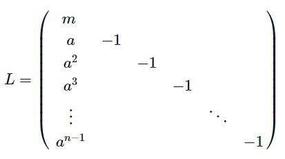

    Найдем базис, используя LLL-алгоритм (просто настоящее чудо в криптографии, алгоритм с большой буквы, в любой непонятной ситуации строй решётку и используй LLL-алгоритм😁)

    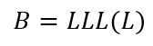

    Учитывая Y и известные верхние 8 бит умножим 

    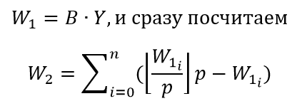

    После этого найдём 

    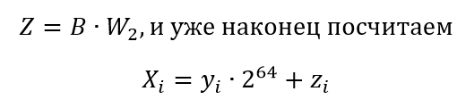

    Аналогично, на самом деле, и в случае, когда b не равно 0. Рассмотрим уравнения состояний

    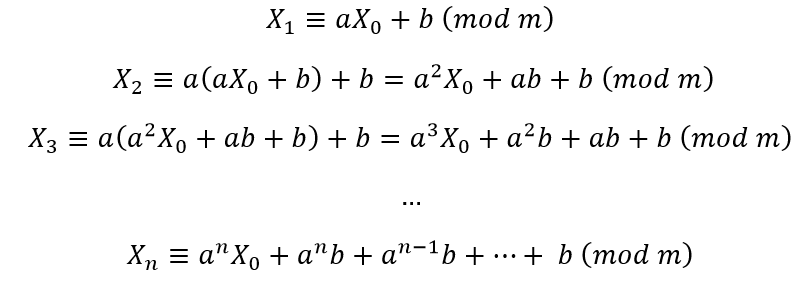

    Заметим, что принцип остаётся тот же самый, надо лишь вычесть эти доп члены, состоящие из известных нам параметров a и b ЛКГ. Обозначим последовательность 

    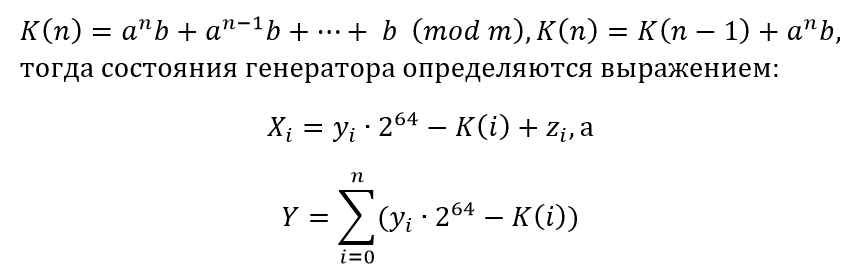

    Остальные все действия те же самые, что и в случае b=0. Также построение решётки и т.д.


- Реализовав атаку, остаётся лишь подобрать нужное количество состояний, для этого нам понадобятся куки созданных юзеров. Но тут возникнет небольшая сложность. Посмотрим, что делает UUIDv4 с рандомной строкой, подаваемой на вход:

    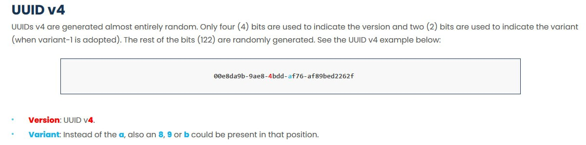

    Видим, что в совокупности из 16 байт изменяется 1 байт, но при этом нельзя восстановить этот исходный байт, значит придётся перебирать значения на этих местах, чтобы правильные состояния генератора. (Таск задуман так, что одного куки будет мало, но перебирать всё равно надо будет всего 1 байт, придётся чуть помучиться, поискать нужное количество байт для восстановления состояния генератора). Оптимальным количеством байт окажется 22, то есть 1 полная кука, в которой перебираем 1 байт, + 6 байтов из 2-ой куки, как раз до первого изменённого значения.

- Подобрав нужную длину, восстановив состояние генератора, восстанавливаем все предыдущие состояния и получаем куки всех пользователей, идущих перед нами, благо в URL прям прописан номер пользователя, что позволяет ориентироваться, а также найти место ошибку в случае нарушения последовательности. Доходим до самого первого и получаем флаг. (Главное, не отвлекаться на фейковые флажки, сгенерированные для пользователей со 2 по 5)


Решение представлено на языке [Sagemath](sploit.py).


### Флаг

```
vka{bowser_is_the_best_snake_player}
```