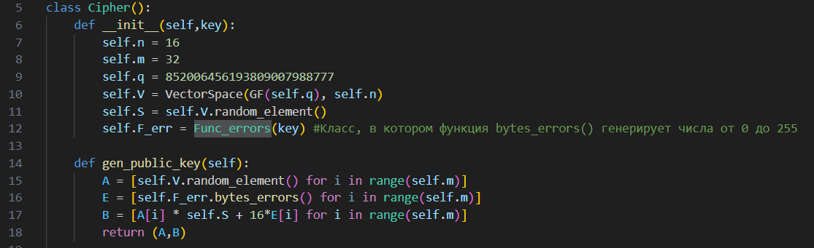
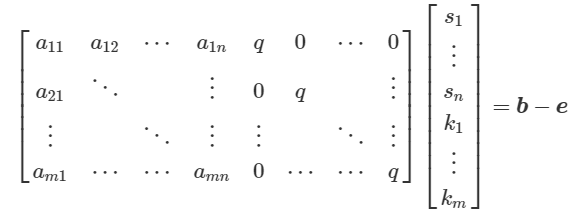

# Боузер-коин мания

|   Cобытие   | Название | Категория | Сложность |
| :---------: | :------: | :-------: | :-------: |
| VKACTF 2023 |  Боузер-коин мания  |  Crypto  |  Сложная  |

## Описание

>Автор: CryptoDjon
>
>Боузер на фоне популярности криптовалют решил создать свою и назвать в честь себя, Боузер-коин (как очевидно). Для взаимодействия с ней его компания разработала специального [Telegram-бота](https://t.me/bowser_coin_bot). Он приглашает всех опробовать майнинг Боузер-коина и говорит, что сделал его абсолютно лёгким, но вот есть нюанс...


# Решение

Для начала посмотрим функционал Telegram-бота, попробуем создать транзакцию, потом намайнить себе монеты, увидим, что за 1 транзакцию прибавляется каких-то 0.1 Боузер-коина, учитывая, что всего 10 попыток, то такими успехами нам ни на что не накопить, а главный приз аж за 100 коинов.

Натыкаемся на рикрол, бесполезно тратим 0.1 коинов, пробуем копить дальше, покупаем грибочек за 10.5 коинов, получаем исходные коды, ну вот теперь можно и таск начать решать.

В ходе изучения заметим, что из secret импортируется класс Func_errors, делаем вывод, что нам ещё предоставлены не все исходники. Также нет самого исходника бота, но для решения достаточно и класса Challenge, как видно, в нём отражен весь основной функционал бота. 

Рассмотрим для начала файл challenge.py, нас интересует, как именно проходит увеличение коинов:


Обнаруживаем случайную генерацию начала и конца транзакции, делаем вывод, что необходимо сначала расшифровать транзакцию, а потом уже её подделывать для большего количества коинов.

Рассматриваем файл cipher.py:



На основе алгоритма генерации публичного ключа с учётом названия Func_errors  делаем вывод, что используется криптосистема LWE (Learning With Errors) (на самом деле, это будет понятно лишь тем, кто уже встречал ранее криптосистему, новичкам в этом придётся искать по ключевым словам и слову Errors). Для тестов придётся написать свою функцию генерации ошибок, но проблем это не составит, так как в комментарии указано, в каком интервале лежат ошибки. 

Приступаем к криптоанализу LWE (проблема LWE в том, что там достаточно расплывчатые требования к параметрам и в самих атаках смутно говорятся условия проведения атак, поэтому скорее всего, придётся перебирать известные атаки). В данном таске предполагается CVP-атака, так как у нас генерируется ошибка, гораздо меньшая, чем модуль q, вдобавок само q достаточно большое для LWE. 

Разберем саму суть атаки:

- У нас имеется открытый ключ (A, b), где A - матрица размером m*n, а b - вектор размером m, нам неизвестен секретный вектор - S, в общем виде представим уравнение как:

    

- Распишем теперь подробнее:

    

    Избавимся от модуля, перепишем систему:

    

    Переведём всё в матричный вид:

    

    И запишем немного по-другому:

    

- Последняя запись рассматривается как решётка, снова используем LLL-алгоритм и алгоритм Бабая ближайшей плоскости (Babai’s nearest plane algorithm), которые дадут хорошую апроксимацию за полиномиальное время. 

Благодаря этой атаке мы найдем S - секретный вектор. Но для неё необходимо будет подобрать нужное количество векторов открытого ключа (в решении в качестве примера использовано 4 файла с публичным ключом, то есть получаем m=128, это даёт гарантированный правильный секретный вектор).

Расшифровываем транзакции, находим случайные строки и расположение количества очков. Подделываем транзакцию на прибавление 999 коинов (здесь необязательно создавать транзакцию с нуля, можно взять уже готовую, заменить 0.1  на 111, просто подставив шифротекст "1" вместо шифротекстов "0" и ".")

Наконец, у нас достаточно коинов для главного приза!... Ловим разочарование, ведь автор задания возомнил себя шутником, поэтому придётся решать задание дальше...  

Остаётся попробовать купить знак ❓, благо там попадается тот самый исходный файл secret.py:


Обнаруживаем подсказку, что же за ключ хочет получить бот, также LFSR (регистр сдвига с линейной обратной связью) и функцию, генерирующую значения для ошибок из криптосистемы LWE. 

Для начала составим массив всех ошибок, используя открытые ключи и найденное S, главное, не забыть про порядок генерирования, это важно для дальнейшего решения.

Приступаем к криптоанализа выходной функции LFSR: 

- составим таблицу всевозможных входов и выходов:

    | X0 | X1 | X2 | F_e |
    |----------|----------|----------|----------|
    |0|0|0|0
    |0|0|1|0
    |0|1|0|1
    |0|1|1|0
    |1|0|0|1
    |1|0|1|1
    |1|1|0|1
    |1|1|1|0
    ||||

- Заметим, что X0 = F_e в 75% случаев, то есть значения X0 коррелируют с выходными значениями. Это признак того, что можно провести корреляционную атаку на [LFSR](https://ru.wikipedia.org/wiki/%D0%9A%D0%BE%D1%80%D1%80%D0%B5%D0%BB%D1%8F%D1%86%D0%B8%D0%BE%D0%BD%D0%BD%D1%8B%D0%B5_%D0%B0%D1%82%D0%B0%D0%BA%D0%B8). 

- Необходимо будет перебрать 2**20 возможных состояний для 1 генератора LFSR с учётом того, что выходные значения должны совпадать не менее 75%.

- Рассмотреть уже систему из 2 генераторов LFSR и также перебрать вероятные начальные состояния. 
    
Но в данном решении представлен более простой подход, необязательно перебирать вручную значения для LFSR, можно заставить решить всё Z3-solver (достаточно тоже мощная вещь, которой много что под силу). Зададим 64 переменных, составим булевые уравнения, использовав биты из известных ошибок и просим z3 подобрать значения:


В зависимости от того, учитывали или нет то, что при создании экземпляра класса LFSR 256 раз обновляется состояние генератора, также порядок получения открытых ключей, надо откатить состояния всех 3 генераторов на k шагов назад, благо, труда это не составит. 

Наконец, получаем ключ, подаём боту на вход и получаем заветный флаг.


Решение представлено на языке [Sagemath](sploit.py).


### Флаг

```
vka{lll_attack_on_lwe_and_correlation_attack_on_lfsr_is_very_easy!}
```