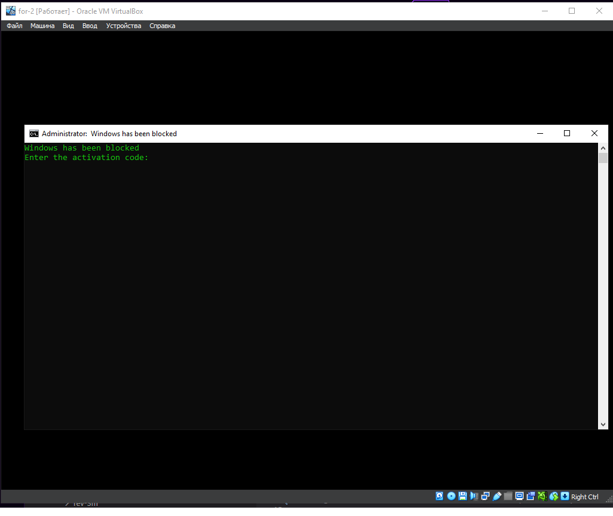
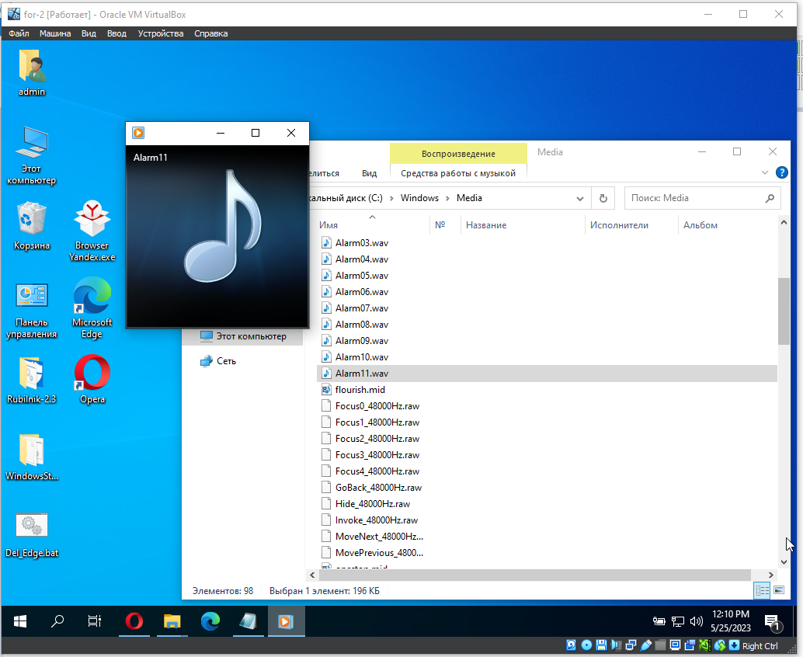
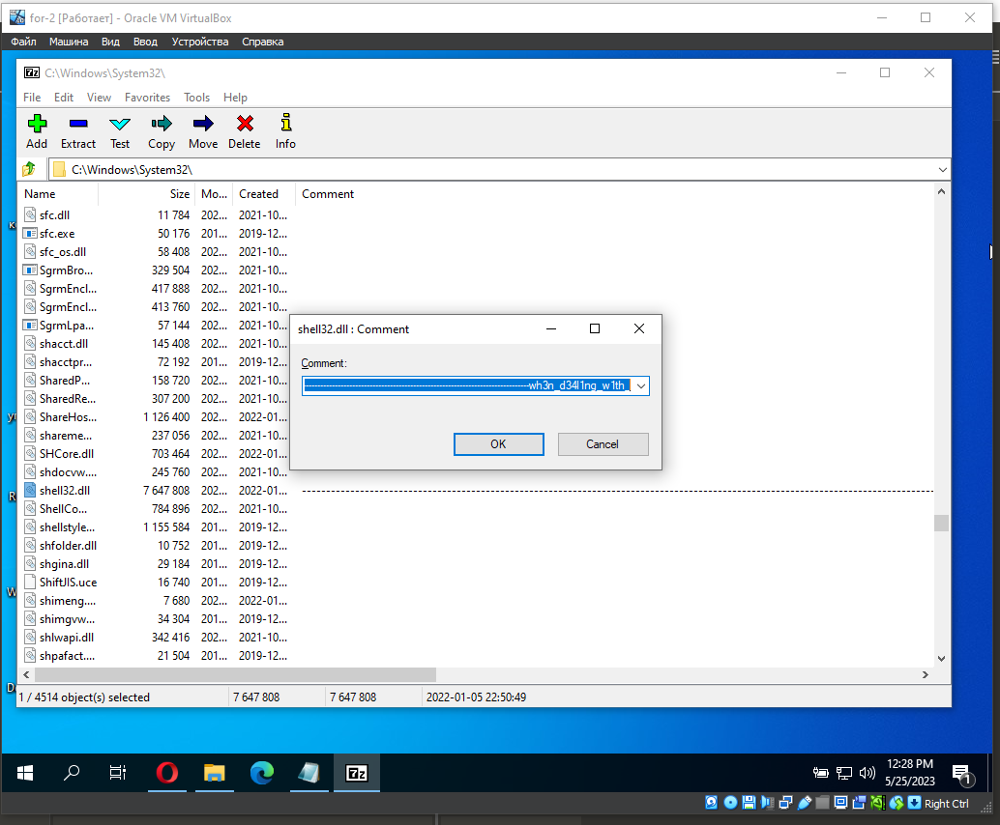

## Вторжение

| Событие | Название | Категория | Сложность |
| :------ | ---- | ---- | ---- |
| VKACTF 2023 | Вторжение | Forensics | Лёгкая |

### Описание

> Автор: 0xR1st0
>
> Находясь на задании пришлось сначала прощупать инфраструктуру инопланетян, но как только удалось проникнуть в их базы данных произошло что-то странное. Всё началось когда решил подключить флешку, тогда стало понятно что враги уже проникли в систему. Даже не знаю что могло произойти, эксперты сказали что проблемы из-за ярлыков, но как только они это произнесли система моментально заблокировалась. Уже много дней мы разбираем как это могло произойти. Возможно ты тот самый герой, выкручивай динамики и начнём приключение!

[Google Disk](https://drive.google.com/file/d/1OrSq6se-uZ0qyN7Hmv4aAal55sNxYNNa/view?usp=drive_link/) 
[Mega](https://mega.nz/file/l2UCzTha#YYrRBvwSSey_CwzpJ82BKaQMbNmO4_b2G61At7tuuEo)
[DropMeFiles](https://dropmefiles.com/FJNAk)

### Решение

Нам дам виртуальный диск от windows10 
Попробуем его подключить и посмотрим что происходит в системе 

Система заблокированна винлокером и требует пароля
Попробуем посмотреть в памяти упоминания о зловреде по его выводу 

Отлично мы смолги найти его инициализацию в системе 
Находим проверку пароля и разблокируем систему 

Из описаниия можно предположить, что очередная часть флага связана с нюансами подлючения носителе к системе 
Попробуем что-то подключить к системе и услышим нестандартный звук
Проверим звуковую дорожку, проигрываеммую при подключении фнешних устройств

Прослушаем подозрительный звук и получим ещё одну часть флага

Осталось проверить ярлыки на что-то подозрительное 
По следующим путям находятся файлы отвечающие за работу ярлыков 
C:\Windows\System32\shell32.dll
C:\Windows\System32\imageres.dll
C:\Windows\System32\ddores.dll

В imageres.dll и ddores.dll нет ничего подозрительного, а вот в shell32.dll можно обнаружить часть флага

 
**Флаг:**

> vka{b3_c4r3ful_wh3n_d34l1ng_w1th_4l13n_pr4nkst3rs}