# Генератор Боузера

|   Cобытие   | Название | Категория | Сложность |
| :---------: | :------: | :-------: | :-------: |
| VKACTF 2023 | Грибной город грехов         | Forensics |  Тяжелая  |

## Описание

> Автор: b1bas
>
> В Грибном киберкоролевстве творится что-то страшное, власти потеряли контроль: грибы торгуют галлюциногенами прямо на улицах, кибербандитизм процветает, жителей находят в канализациях мертвыми... Полковник Тоад недавно потерял своего ценного сотрудника, по совместительству - жениха Принцессы Дейзи, который работал над секретной разработкой. Тебе предоставили дамп оперативной памяти с компьютера жертвы прямо перед его исчезновение: мы видели как он оставил какое-то послание прямо перед тем, как к нему в трубу ворвались прихвостни Боузера. Нам кажется, что там скрыты данные, которые помогут надолго упрятать Боузера за решетку.
>
>[Yandex Drive](https://google.com)
>
>[Google Drive](https://yandex.com)
>
>[DropMeFiles](https://dropmefiles)


# Решение

Нам дан дамп оперативной памяти и какой-то непонятный файл. Отложим пока непонятный файл, и разберемся с дампом. Использовать будем Volatility 3. Посмотрим список процессов:

```code
python3 ~/volatility3/vol.py -f image.mem windows.pstree
```

Вывод: 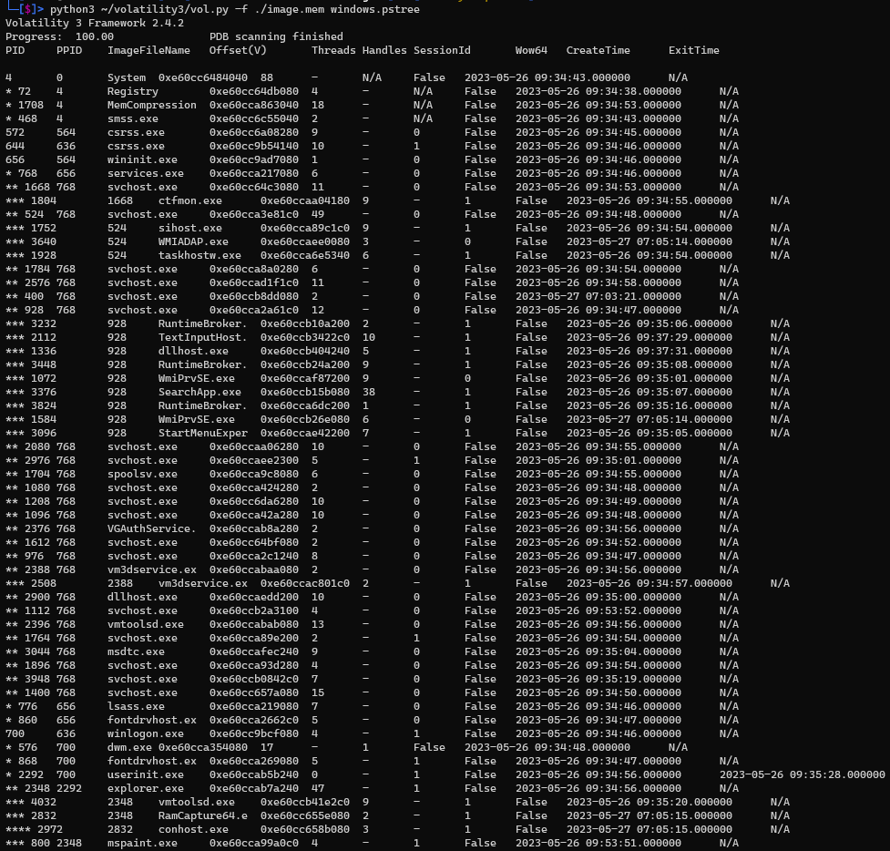

Заметим, что запущен Paint. Попробуем взять скриншот экрана. Для этого дампим память процесса explorer.exe:

```code
python3 ~/volatility3/vol.py -f image.mem windows.memmap --pid 2348 --dump
```

На выходе получим файл `pid.2348.dmp`

Узнаем разрешение экрана:

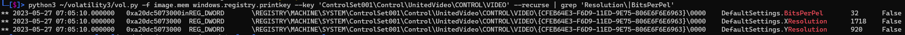

Переименовываем `pid.2348.dmp` в `pid.2348.dmp.data` и засовываем в GIMP:

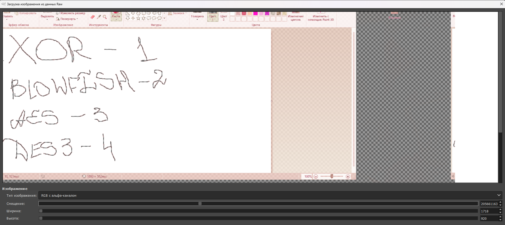

На данном этапе можно возвращаться ко второму файлу. Проанализируем что в нем есть: заголовок, файлы, таблица файлов.
Посмотрим как эти файлы расположены. Возьмем за пример первые два встречающихся файла:

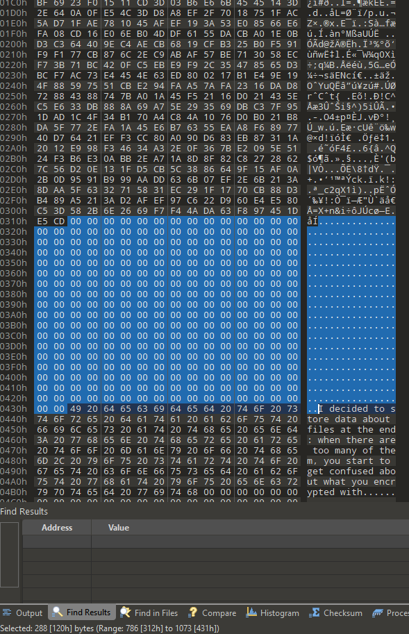

Расстояние между файлами 288 байт. Возьмем на заметку.

Теперь посмотрим в таблицу файлов: 1ый файл - something.png. Посмотрим из чего состоит описание файлов: название, что-то похожее на контрольную сумму и непонятное поле.

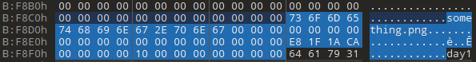

Предположим, что это оффсет. Перейдем по нему:
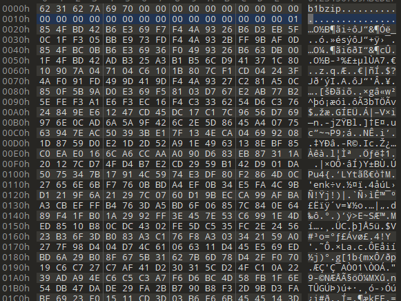

Рассмотрев парочку других примеров шифрованных файлов, найдем, что все они примерно указывают на начало файла, но почему-то с неточностью. Также выясним, что на самом деле расстояние между файлами не 288, а 256. Надо понять что означают следующие 32 байта. Для этого рассмотрим сравнение первых 32 байт шифрованного и нешифрованного файлов:
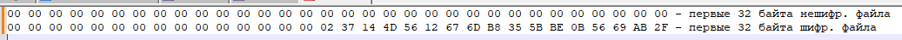

Различия начинаются на 16 байте. Немного поизучав все файлы выясняется, что все это варьируется от 0 до 4, причем 0 - плэйнтекст. Тут нам и пригодится скриншот с дампа. Следующие 16 байт следует попробовать в качестве ключа.

В таблице файлов есть записи о 21 файле, среди которых 7 картинок. 4 .png с названиями `something.png`, `interesting.png`, `inside.png`, `this.png`, 2 .jpg с названиями `autoportrait.jpg`, `mybestfriend.jpg` и одна webp-картнка с названием `CUMir.webp`. Ну, наиболее похожее на правду - картинки с разрешением .png

Расшифруем какой-нибудь текстовый файл, к примеру - `day42.txt`, чтобы проверить нашу догадку о ключе.

Перейдем по оффсету `0x0A9869`

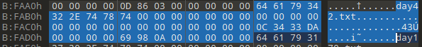

Запишем 16 байт после `0x03` в файл
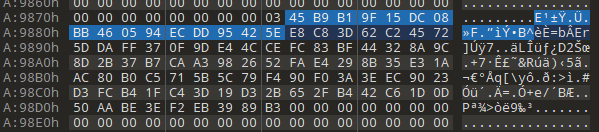

Запишем все байты до нулей в файл
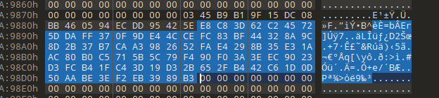

И, в соответствии с картинкой из дампа, напишем скрипт для расшифрования AES:
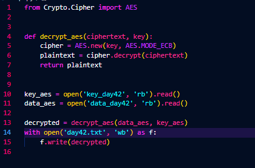

В результате получаем расшифрованный текст:
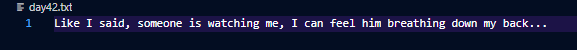

Похожим образом расшифровываем все картинки .png и получаем флаг

Решение представлено на языке [Python](sploit.py).

### Флаг

```
vka{amazing_knowlegde_of_filesystems}
```
