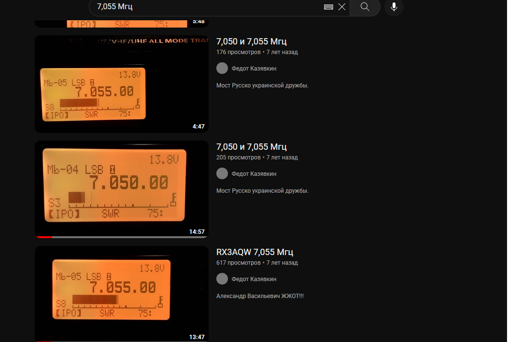
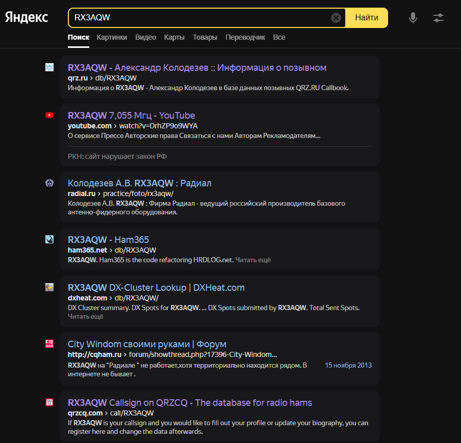
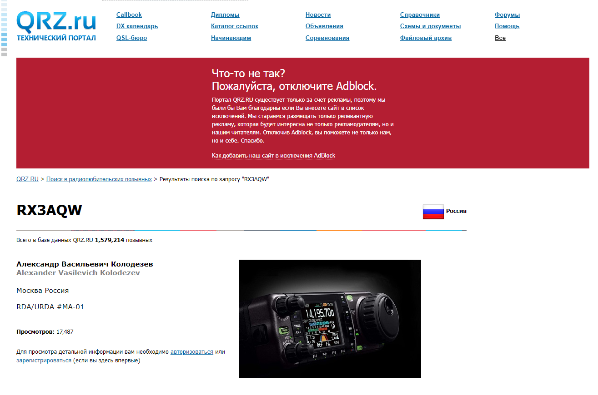
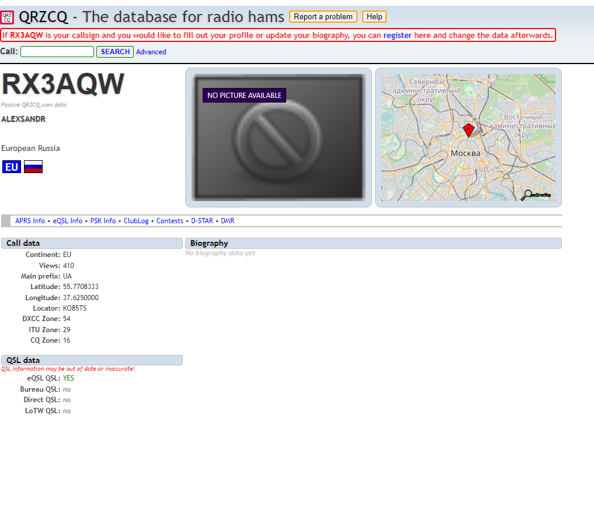

# Вне закона 

|   Cобытие   | Название | Категория | Сложность |
| :---------: | :------: | :-------: | :-------: |
| VKACTF 2023 |  Вне закона  |  Osint  |  Средняя  |

## Описание

>Автор: 0xR1st0
>
>Направляясь из Сен-Канар Скрудж МакДак решил послушать радио и расслабиться, но услышал своего злейшего врага Ликвидатора. Без раздумий Скрудж направился в канализацию, но точного места он пока не знал. Помоги нашему герою найти логово Ликвидатора.

Флаг это координаты места его последнего эфира. 
Пример флага vka{30.0000_30.0000}

# Решение

Из записи можно подчеркнуть самое главное - это частота 7.055

Списки сотрудников слишком обширны поэтому поищем саму запись 
На YouTube можно найти записи данной частоты 



От сюда мы выяснили псевдоним ведущего RX3AQW
Посмотрим что можно узнать от обычного поиска 



Перейдя по первой ссылке мы узнаем кто скрывается за этим псевдонимом



Но просмотрев чуть больше можно наткнутся на https://www.qrzcq.com/ где и будут координаты последнего эфира




### Флаг

```
vka{55.7708333_37.6250000}
```