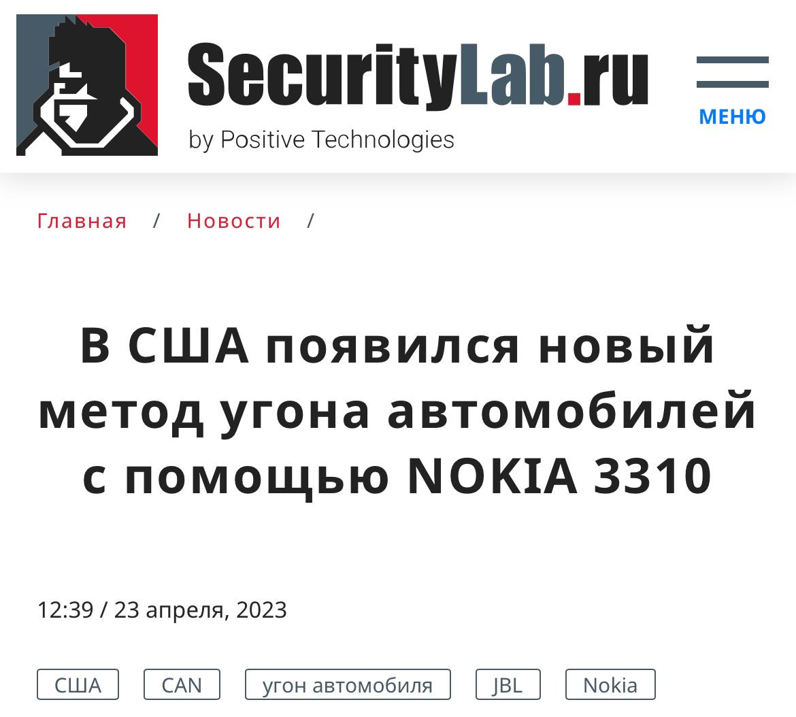
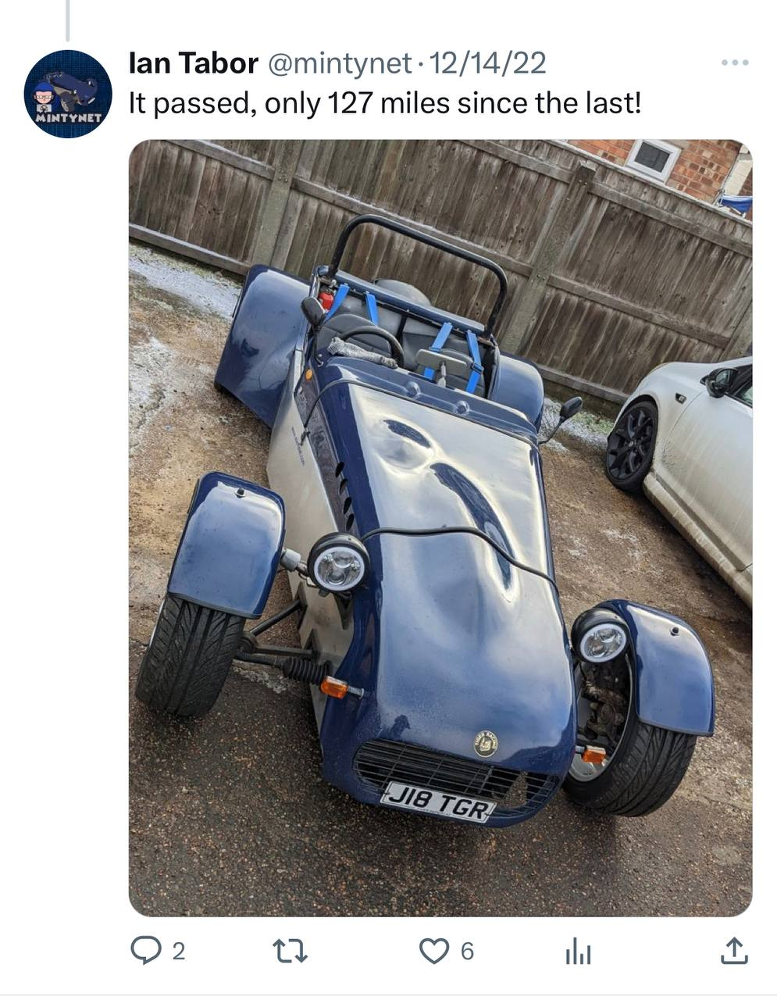
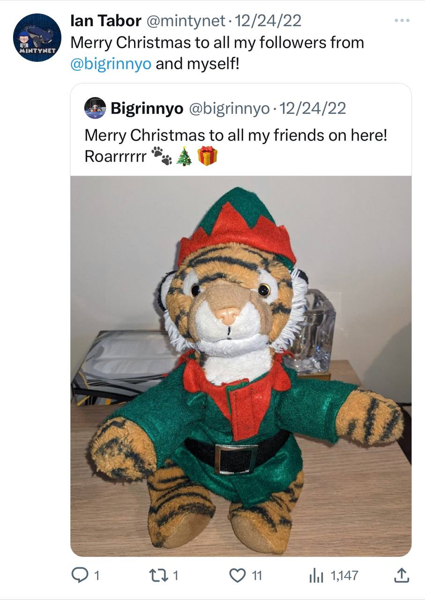
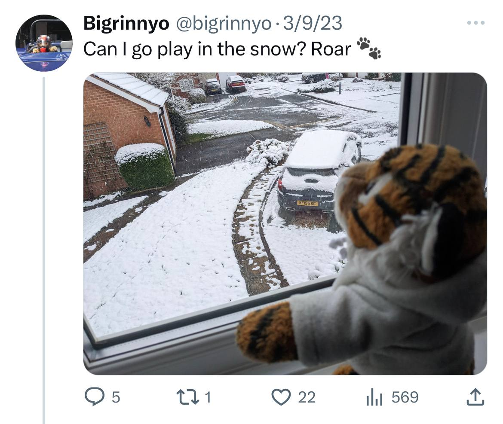

## Новые разработки

| Событие | Название | Категория | Сложность |
| :------ | ---- | ---- | ---- |
| VKACTF 2023 | Новые разработки | Osint | Cредняя |

### Описание

> Автор: 0xR1st0
>
> Долгое время команда пентестеров из "Красного сокола" искала инструмент для уничтожения американцев. Все работы проходили в режиме строгой секретности и сотрудники даже не могли принести с собой телефон, а пользовались выданными телефонами Nokia. Все сотрудники работали на славу, но однажды на базу напали Билли и Ланс. Они уничтожили все наработки и скрылись в неизвестном направлении. Никто никогда не мог их вычислить и предугадать куда они нападут и где находятся, но сейчас мы знаем что они выкрали телефон и пары автомобилей нашего директора, а сейчас рассекают с ними по америке. Помоги нам найти номера украденных ими авто и мы щедро тебя отблагодарим.  

Пример флага vka{CD0AAFG_DFDRY090}

### Решение

Из описания задания можно понять, что требуется искать информацию о краже автомобилей с использованием Nokia3310

На данную тему есть множество статей, но первым кто обнаружил данную уязвимость был Йен Табол (одна из таких статей была выложенна SecurityLab)

Йен активно ведёт свой твитер @mintynet 

На странице Йена можно найти множество постов с его автомобилем (JI8TGR)

Ссылка на твиты плюшевого мишки @bigrinnyo с которым везде путешествует часто встречаются на аккаунте Йена 

3/9/23 @bigrinnyo выложил твит где на фоне можно рассмотреть номер второго авто (KFI5EKC)

 
**Флаг:**

> vka{KFI5EKC_JI8TGR}