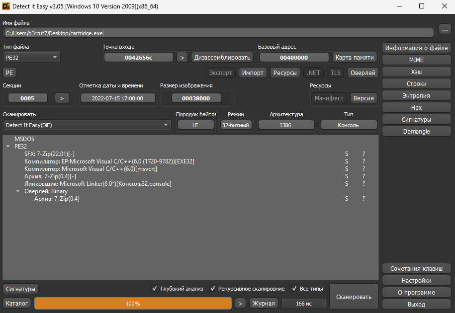

# Chinese cartridge

|   Cобытие   | Название | Категория | Сложность |
| :---------: | :------: | :-------: | :-------: |
| VKACTF 2023 |  Китайский картридж  |  Reverse  |  Легкая  |

## Описание

>
>Автор: [b3rcut7]
>
>Месяц назад я заказывал картридж с моим любимым DOOM! Наконец-то он пришёл! А что с коробкой? Замок какой-то...
>

# Решение

Итак, мы получаем бинарь cartridge.exe, сразу закидываем его в DetectItEasy:




В DIE (Или при попытке запустить бинарь) видим,что это SFX 7-Zip архив. Попробуем его взломать (Описание намекает что пароль - 5 цифр):


Получив пароль распаковываем архив


Внутри лежит еще один бинарь game.exe, снова кидаем его в DIE. Понимаем что это VMProtect.


Попробуем запустить, программа просит права админа... Даем ей их, но бинарь ничего не делает.


Попробуем отловить WinAPI. Я буду использовать Process Monitor для этого:


Замечаем, что создаются файлы с флагами -> проверяем их, но это фейковые флаги :)
Однако видим, что в реестр пишутся 2 параметра, а затем сразу удаляются.
Смотрим содержимое part_0x01 и part_0x02, складываем в одну строку и переводим:


```
```

### Флаг

Сдаем флажочек!

```
vka{w1ndOws_r3615tRy_I5_mY_f4VorI7E_5t4SH}
```