# Сервер мертвеца

|   Cобытие   | Название | Категория | Сложность |
| :---------: | :------: | :-------: | :-------: |
| VKACTF 2023 |  Сервер мертвеца  |  Reverse  |  Средний  |

## Описание


>Автор: [b3rcut7]
>
>И отбившись от всех птиц...зомби и прочей нечисти, спрятав свой Big Hacking Gun - 9000, ты подходишь к двери с надписью 'Серверная'. Слышно лишь гудение вентиляторов и пищание Dial-up модема...Ты садишься за компьютер...
> - *Введите пароль*
>
> - "admin"
>
> - *Пароль неверный! Осталось 2 попытки!*
>
> -  Хммм...На столе лежит фотография девушки, снизу подпись - Xakergirl.
> Окей, "Xakergirl"..?
>
> - *Пароль неверный! Осталась 1 попытка!*
>
> - Недолго думая ты вводишь IDDQD.
>
> - Доступ разрешён!
>
> Посмотрим, что тут у нас...Какой-то файл...'server'? Нужно изучить...
>

# Решение

Получаем файл, посмотрим что это:

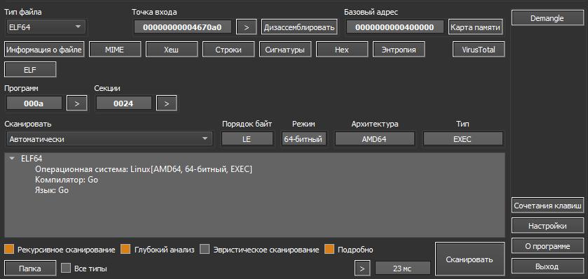


Сразу летим в IDA Pro, находим функцию **main_main**:

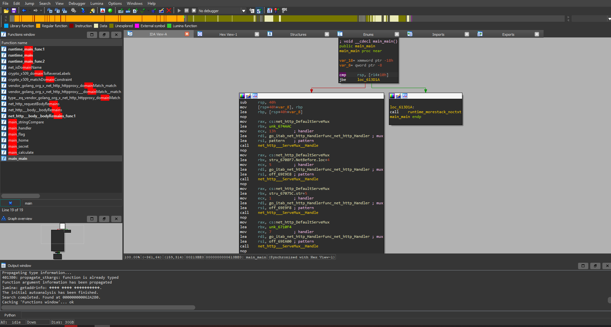


Разберемся немного с переменными и переименуем их:

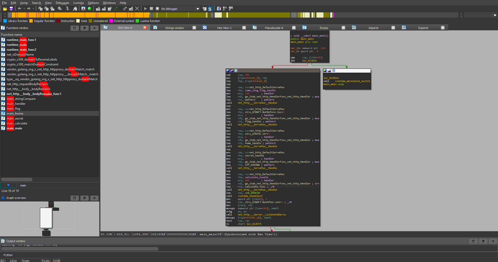


Внимание цепляет handle с именем **/somelongflaghandle**

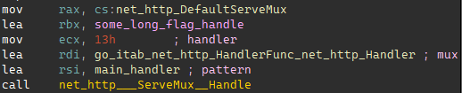


Перейдем в функцию main_handle. В самом начале замечаем 2 параметра **first** и **second**, а затем вызов метода **Query**. Это значит нам необходимо будет передавать параметры:

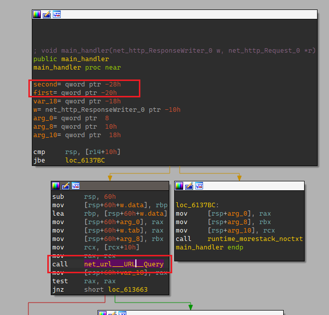


Изучаем далее, видим три очень похожих друг на друга блока, в которых передаются наши параметры(**ParseInt** подсказывает нам что это int), а так как их три, значит и параметра три:

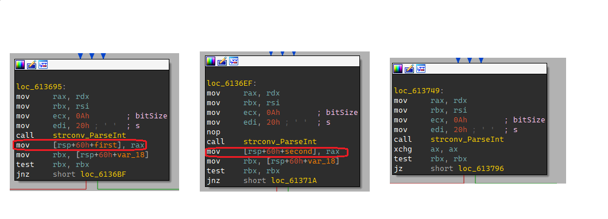


И в самом конце функции **main_handle** находим сравнение:

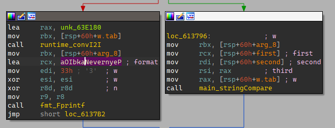


Определим переменную и убедимся что мы действуем правильно:

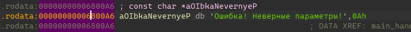


Наша идея подтверждается, параметра три. Переходим в функцию **main_stringCompare**.Здесь сразу замечаем 3 параметра:

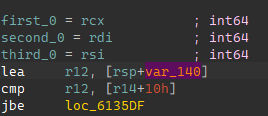


Откроем псевдокод, так будет понятнее... Находим условия выполнения основной части:

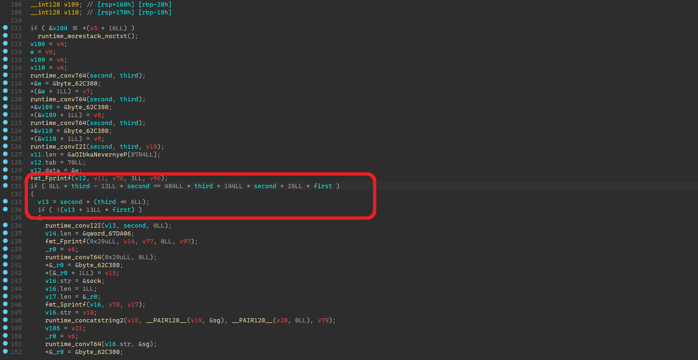


Составим СЛАУ:

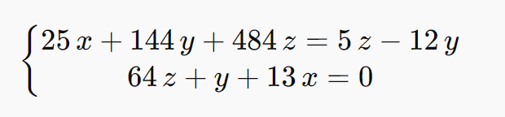


Для ее решения напишем простенький [скрипт](../exploit/solve_system.py) на **python** с использованием решателя **Z3**

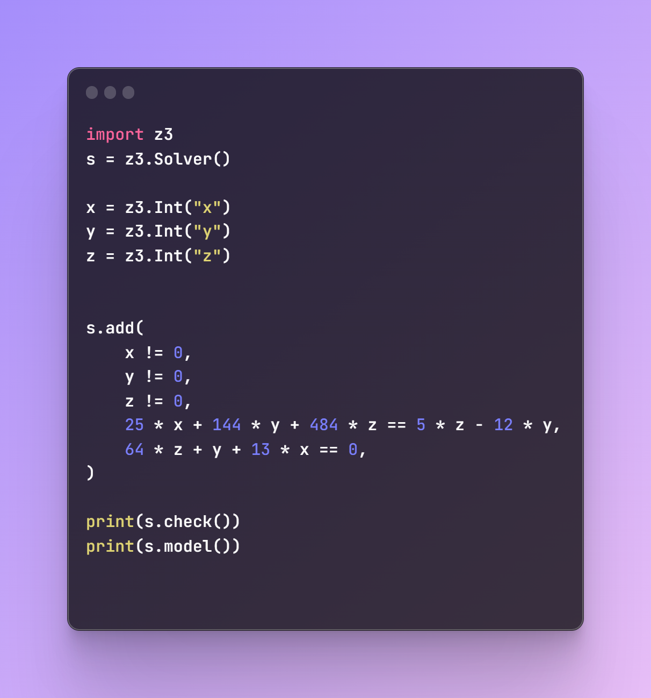


Результат работы скрипта:

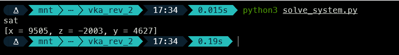


Запустим наш сервер и попробуем передать ему вычисленные параметры:

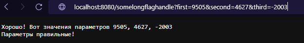


Продолжаем изучать ASM, находим значение переменной **key**:

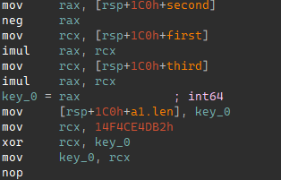

```
key = 9505 * 2003 * 4627
```

Видим странное значение которое ксорится с нашим ключом, проверим результат:

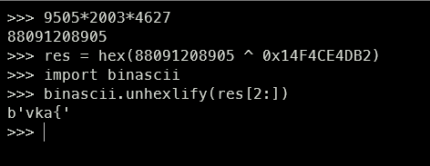


Отлично, первый шаг сделан! Осталось лишь написать [скрипт](../exploit/decoder.py):

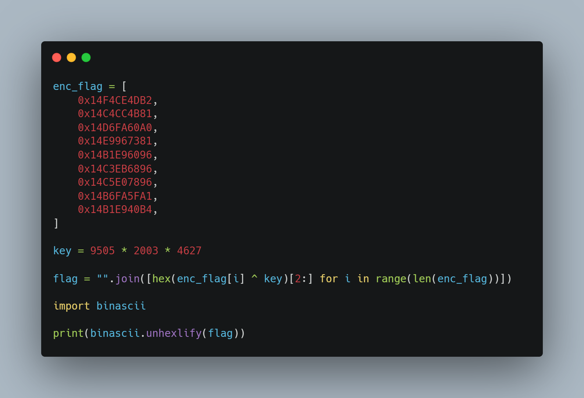


Запускаем и получаем флажок!

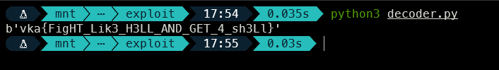


### Флаг

```
vka{FigHT_Lik3_H3LL_AND_GET_4_sh3Ll}
```
