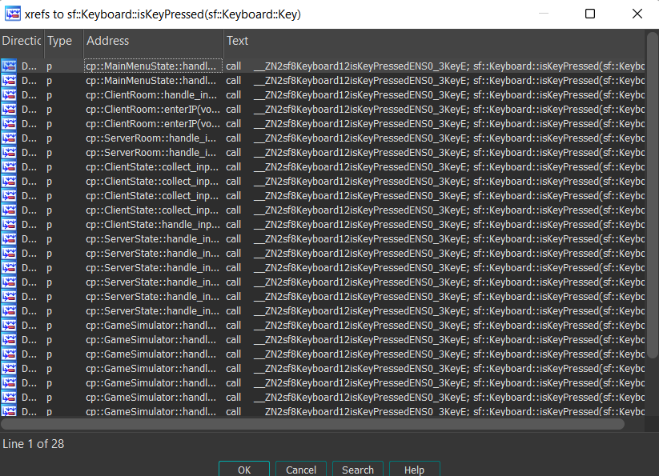
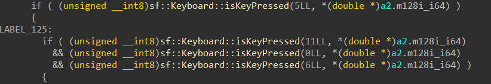
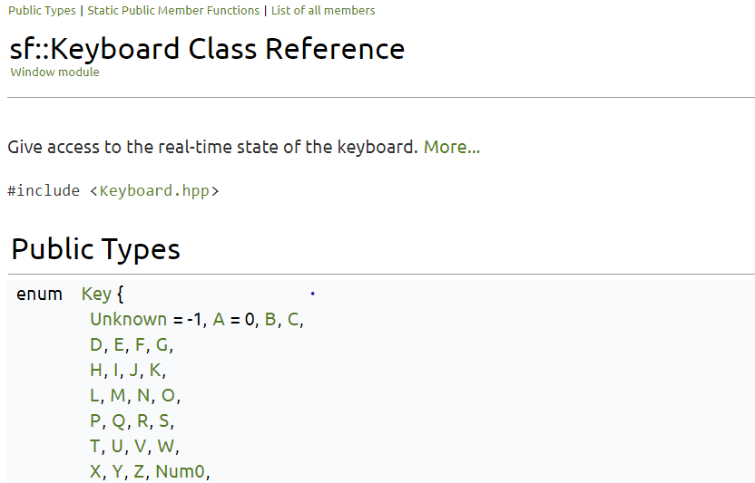
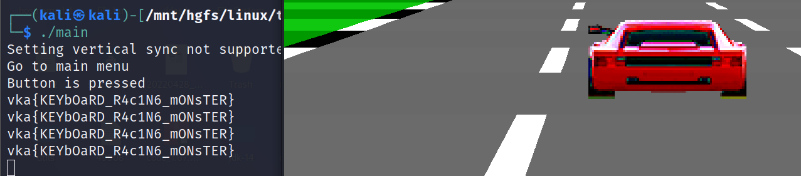

# Malware

|   Cобытие   | Название | Категория | Сложность |
| :---------: | :------: | :-------: | :-------: |
| VKACTF 2023 |  Racing car  |  Reverse  |  Средняя  |

## Описание

>Автор: [Prokuror]
>
>🠖 - вправо, 🠔 - влево, 🠕 - вперед, 🠗 - назад, Q - выйти, ...
# Решение

Запускаем игру, пытаемся выиграть, но играть можно очень долго

Если посмотреть на описание к таске, то можно догадаться о каком-то лишнем функционале

Находим функцию обработки нажатия клавиш `sf::Keyboard::isKeyPressed` из [SFML](https://www.sfml-dev.org/index.php) и сразу посмотрим где она вызывается



Вероятнее всего в `cp::GameSimulator::handle_input` то, что нам нужно, находим странные условия



Есть два варианта:
1) Запатчить, а это не составляет труда
2) Посмотреть, что же за аргументы передаюся по [ссылке](https://www.sfml-dev.org/documentation/2.5.1/classsf_1_1Keyboard.php)



Из документации, можно сделать вывод, что:
5 - F
11 - L
0 - A
6 - G

Значит должны быть одновременно нажаты клавиши с буквами `F` `L` `A` `G`

Пробуем и получаем флаг в консоли


### Флаг

```
vka{KEYbOaRD_R4c1N6_mONsTER}
```

