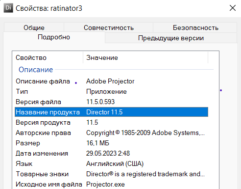
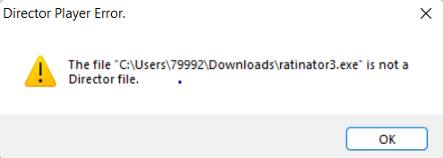
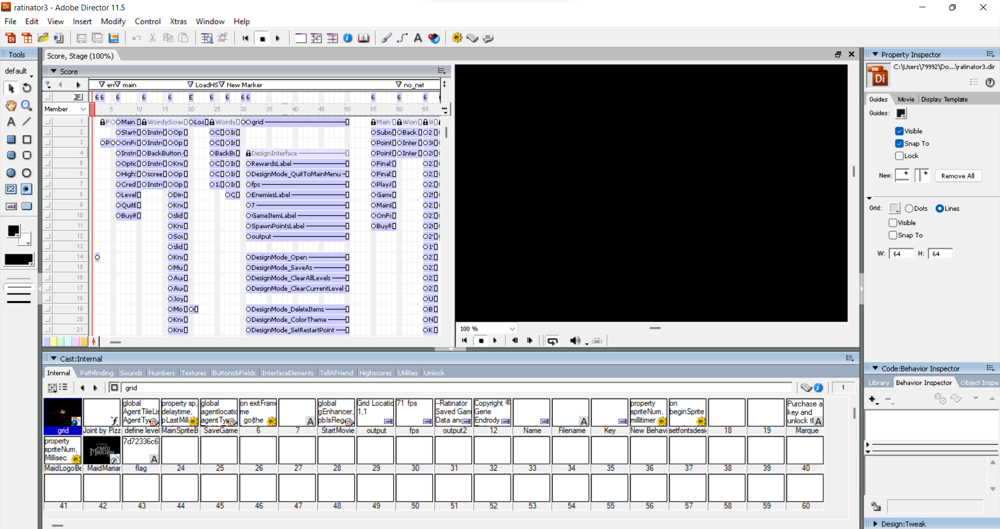
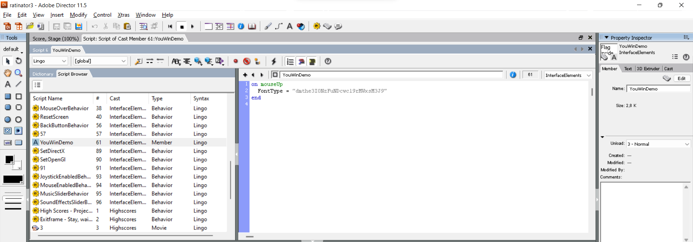

# Malware

|   Cобытие   | Название | Категория | Сложность |
| :---------: | :------: | :-------: | :-------: |
| VKACTF 2023 |  Ratinator  |  Reverse  |  Средняя  |

## Описание

>Автор: [Prokuror]
>
>Марио долго бродил по замку и нашел тайную комнату, но попасть туда было не так просто...
# Решение

Запускаем игру, пробуем выиграть, но это трудновато и долго. но мы же реверсеры!
Die нам особо ничего не говорит, но если посмотреть свойства в windows, то увидим, что игра написана в Adobe Director 11.5



Скачиваем Adobe Director 11.5, также находим лицензионный ключ, активируем, пробуем открыть в нем нашу игру. Но не так все просто



Для реверса проектов, созданные в Adobe Director, имеются готовые решения такие как [ProjectorRays](https://github.com/ProjectorRays/ProjectorRays), и [director-files-extract](https://github.com/n0samu/director-files-extract)

Сначала, запускаем shock.py, затем расшифровываем получившийся файл ratinator3.dxr с помощью `projectorrays-6727731.exe`

```PS
PS C:\Users\79992\Downloads> .\shock.py .\ratinator3.exe
PS C:\Users\79992\Downloads> cp .\ratinator3\ratinator3.dxr .
PS C:\Users\79992\Downloads> .\projectorrays-6727731.exe decompile .\ratinator3.dxr -o .\ratinator3.dir
Decompiled Adobe Director 11.5 movie .\ratinator3.dxr to .\ratinator3.dir
```

Закидываем ratinator3.dir в Adobe Director и получаем полный проект нашей игры



Так наша цель пройти игру, находим скрипт отвечающий за вывод окна после прохождения под названием `YouWinDemo`



Видим base64, декодируем, получаем флаг

### Флаг

```
vka{r471n470r_k1ll3r}
```

