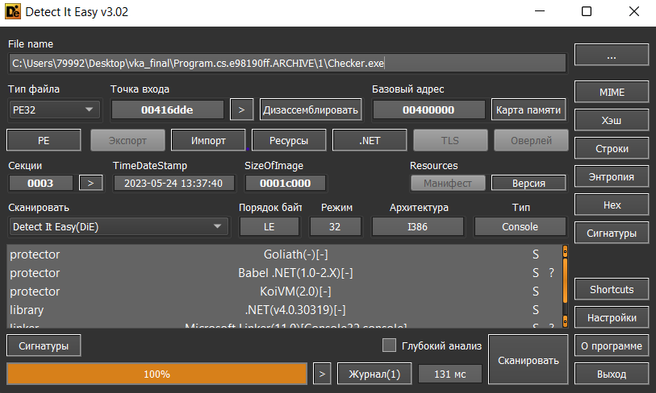
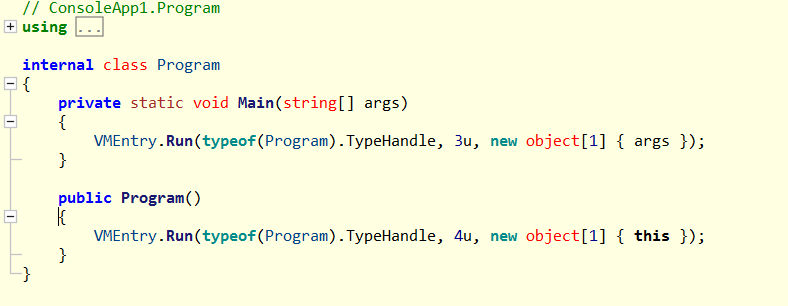
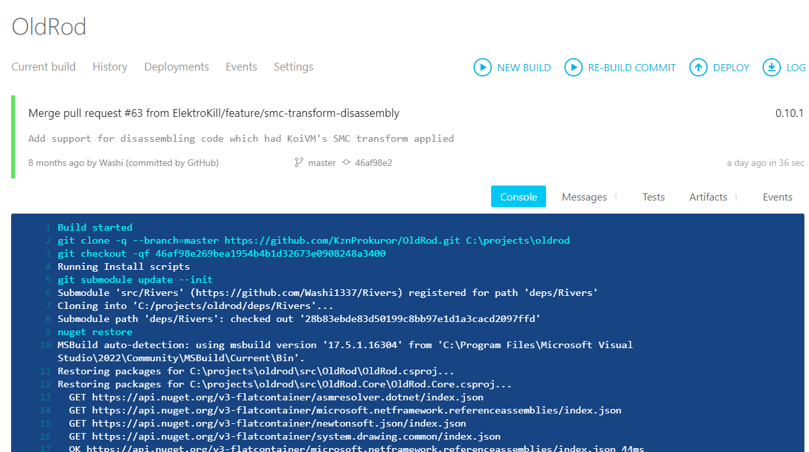
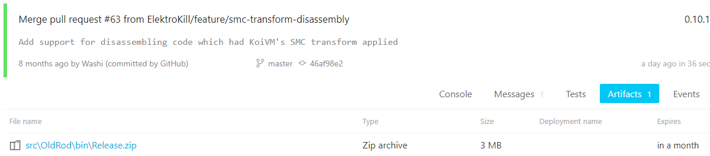
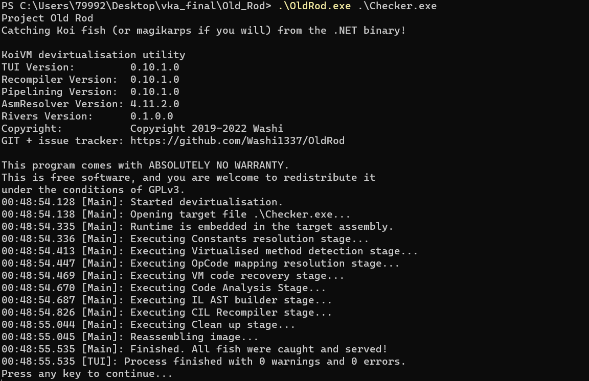
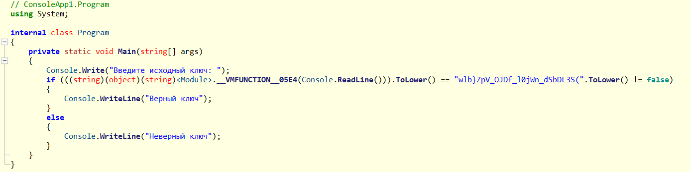

# hard door lock

|   Cобытие   | Название | Категория | Сложность |
| :---------: | :------: | :-------: | :-------: |
| VKACTF 2023 |  hard door lock  |  Reverse  |  Сложная  |

## Описание


>Автор: [Prokuror]
>
>Марио долго бродил по замку и нашел тайную комнату, но попасть туда было не так просто...

# Решение

Нам дан .exe файл, при выполнении необходимо ввести какой-то ключ. Закидываем в Detect It Easy:



Программа написана на платформе .Net и защищена [KoiVM](https://github.com/Loksie/KoiVM-Virtualization)

Если открыть файл в [ILSpy](https://github.com/icsharpcode/ILSpy), то поймем, что реверс затруднителен


Копаемся в Интернете и находим девиртуализатор [OldRod](https://github.com/Washi1337/OldRod) для KoiVm, компилируем его и скачиваем




Девиртуализируем



Снова прыгаем в ILSpy



Немного сидим и вникаем в прогу, в результате чего рождается обратный алгоритм для извлечения ключа:

```python
def decrypt_key(encrypted_key):
    substitution_matrix = [
        ['A', 'B', 'C', 'D', 'E', 'F', 'G', 'H', 'I', 'J', 'K', 'L', 'M', 'N', 'O'],
        ['P', 'Q', 'R', 'S', 'T', 'U', 'V', 'W', 'X', 'Y', 'Z', 'a', 'b', 'c', 'd'],
        ['e', 'f', 'g', 'h', 'i', 'j', 'k', 'l', 'm', 'n', 'o', 'p', 'q', 'r', 's'],
        ['t', 'u', 'v', 'w', 'x', 'y', 'z', '{', '}', '(', ')', '-']
    ]

    decrypted_key = ""

    for char in encrypted_key:
        decrypted_char = decrypt_char(char, substitution_matrix)
        decrypted_key += decrypted_char

    return decrypted_key


def decrypt_char(char, substitution_matrix):
    for row in substitution_matrix:
        if char in row:
            decrypted_index = (row.index(char) - 1) % len(row)
            return row[decrypted_index]

    return char

def main():

    # Ввод зашифрованного ключа 
    user_input = input("Введите зашифрованный ключ: ")

    # Расшифровка зашифрованного ключа
    decrypted_key = decrypt_key(user_input)
    print(decrypted_key)

if __name__ == "__main__":
    main()
```

### Флаг

```
vka{y0U_nice_k0iVm_CRacKEr}
```
