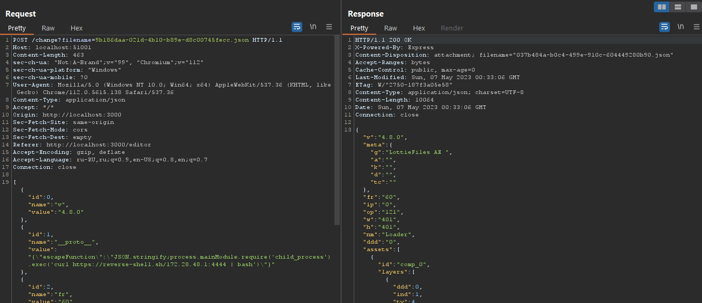
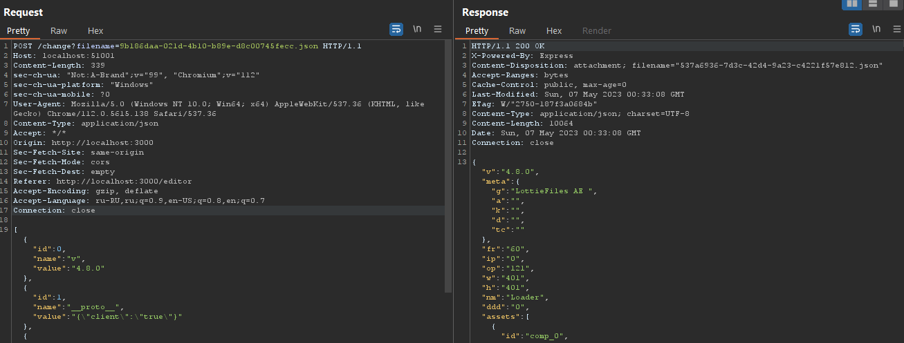
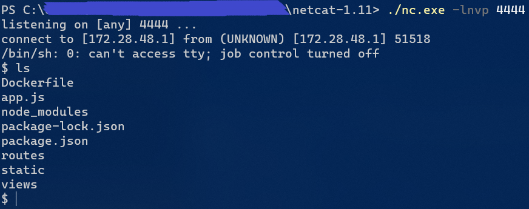

## Lottieditor

| Событие | Название | Категория | Сложность |
| :------ | ---- | ---- | ---- |
| VKACTF 2023 | Lottieditor  | Web | Medium |

  
### Описание


> Автор: [ vChuk ]
>
Когда-то давно, в волшебной стране, нарисованной из пикселей, жила веселая и храбрая героиня по имени Лотти. Она была маленькой девочкой, изображенной в виде JSON-файла, и обладала уникальной способностью принимать различные формы и становиться разными персонажами. Однажды, Королевство Грибного Полиса, где Лотти жила, было захвачено злобным Купой. Этот Купа был необычайно злым и хитрым врагом, и он запер принцессу Пич и других обитателей королевства в высокой башне замка. Помоги им выбраться
> 


### Решение
Был дан исходный код приложения. Из функционала - изменение JSON файла. Ввиду логики приложения, можно было изменять вложенные объекты
```js
metadata.forEach((data) => {
    newData.forEach((ch) => {
      if(ch.id === data.id){
        if( typeof(data.value) === typeof({})){  // Если значение - словарь  ----------------------------------------
          try{                                                   //                                                 |
            moreData = JSON.parse(ch.value)                      //                                                 |
          } catch {                                              //                                                 |
            err = true                                           //                                                 |
            return                                               //                                                 |
          }                                                      //                                                 |
          for (const [key, value] of Object.entries(moreData)) { // То изменяй каждое значение поочередно  <---------
            lottie_json[ch.name][key] = value                    // <- Server Side Prototype Pollution gadgets to RCE
          }
        } else{
          lottie_json[ch.name] = ch.value
        }
      }
    })
})
```
Так-же был использован шаблонизатор EJS.
Если емеется примитив, контроль над `a, b, c` и использование `EJS`
```js
    {}[a][b] = c
```
то, возможно [получение RCE](https://mizu.re/post/ejs-server-side-prototype-pollution-gadgets-to-rce)

Выполнив 2 запроса, а затем отрендерив любую страницу получаем RCE





### Флаг

```
vka{big_require_big_rce}
```